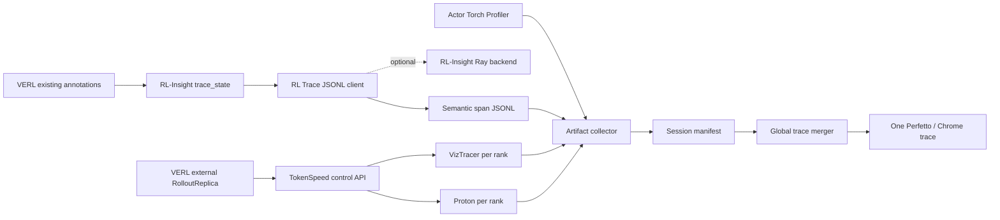

# Global RL Trace Bridge 设计文档

## 1. 项目状态

本项目希望为分布式强化学习训练提供统一的 Chrome Trace / Perfetto 视图，将训练、推理和 GPU kernel 的异构 profiler 输出放到同一条全局时间线上。

当前代码是组件级 PoC，已经验证：

- RL-Insight trace event 可以转换成增量 Chrome Trace JSONL；
- 可选 monkey patch 可以围绕 VERL `DistProfiler` profiling window 启停 actor 侧 VizTracer；
- observer 异常不会中断原 profiler backend；
- monkey patch 支持幂等安装和安全卸载。

当前尚未形成端到端 Global RL Trace Bridge。特别是 worker backend 选择、artifact manifest、全局身份映射、时钟校准、TokenSpeed 控制和最终 merger 仍待实现。

## 2. 背景与问题

一次 VERL RL 训练通常跨越多类进程和 profiler：

| 领域 | 典型进程 | 主要 profiler | 能回答的问题 |
| --- | --- | --- | --- |
| Actor / Critic 训练 | PyTorch distributed workers | Torch Profiler | operator、CUDA launch、训练 kernel |
| RL 阶段语义 | trainer、actor、rollout workers | RL-Insight | actor update、log-prob、generate 等阶段 |
| Rollout Python 调度 | TokenSpeed scheduler ranks | VizTracer | Python 调度、请求处理、scope |
| Rollout GPU kernel | TokenSpeed scheduler ranks | Proton | Triton/kernel timeline |

这些 profiler 分别输出不同文件，使用不同 PID/rank 命名和时间基准。仅仅把 JSON 拼接起来会产生以下问题：

- worker 上的语义 span 可能没有进入自定义 collector；
- 不同节点可能拥有相同 OS PID；
- `rank_0`、`replica_0` 等 lane 名在不同角色之间重复；
- wall clock、Torch、VizTracer 和 Proton 的时间原点不同；
- artifact 分散在多个节点，缺少完整性和归属信息；
- 时间接近不能证明 actor 请求与 rollout/kernel 之间存在因果关系。

## 3. 项目目标

### 3.1 Session-level MVP

首个可交付目标是在一次 profiling session 内生成单个可由 Perfetto 打开的 trace，至少包含：

- 一个或多个 actor Torch Profiler trace；
- VERL/RL-Insight 的 semantic lanes；
- 多个 TokenSpeed rank 的 VizTracer Python trace；
- 多个 TokenSpeed rank 的 Proton GPU kernel trace；
- 稳定、无冲突的 process/thread identity；
- 可验证的时间归一化和 clock-skew 诊断；
- manifest 中声明的 artifact 完整性状态。

### 3.2 Request-level Bridge

第二阶段在 session-level 视图上增加因果关系：

- 为 rollout 请求生成全局 `trace_id/request_id`；
- 从 actor/driver 传播到 rollout replica；
- 在 RPC 两侧写入匹配的 Chrome flow event；
- 将 rollout Python scope 继续连接到 Proton kernel scope。

### 3.3 最小侵入原则

- VERL core 默认零修改；
- 优先复用 VERL 已有的 RL-Insight 埋点；
- TokenSpeed 和 VERL 不互相依赖；
- 本项目作为独立 integration package 依赖两者；
- actor VizTracer 仅作为可选功能启用薄 monkey patch；
- 只有外部方案无法可靠实现时，才考虑向上游增加通用 hook。

## 4. 非目标

首个 MVP 不计划：

- 替代 Torch Profiler、RL-Insight、VizTracer 或 Proton；
- 在 Perfetto 中实现在线流式展示；
- 在无任何同步信息时自动修复任意跨节点时钟漂移；
- 推断没有显式 ID 的 request-level 因果关系；
- 修改 VERL `ProfilerConfig.tool` 为多 profiler 列表。

## 5. 总体架构



## 6. 关键实现设计

### 6.1 RL-Insight 语义事件采集

VERL 已经在 actor 和 rollout 路径调用 `RLInsightLogger.trace_state`。本项目不重复 patch 这些业务函数，而是注册 RL-Insight monitor client。

当前实现注册了名为 `rl_trace_observer` 的 backend，并将 trace event 写成 append-only JSONL。增量写入避免依赖 Ray worker 的优雅退出。

但 VERL worker 首次调用 `trace_state` 时可能执行无参数 `rl_insight.init()`，从而选择默认 `ray` backend，而不是 driver trainer config 中的自定义 backend。

MVP 方案：

1. RL-Insight 增加 `RL_INSIGHT_SERVER_BACKEND`，覆盖 `server.backend`（verl-project/rl-insight#190，已合入 main）；
2. 插件在每个进程加载时注册 `rl_trace_observer` backend，并默认设置 `RL_INSIGHT_SERVER_BACKEND=rl_trace_observer`（用户显式设置时不覆盖）；
3. worker 即使无参数初始化，也会进入本地 collector；
4. 若用户启用原 RL-Insight 服务，event 同时转发给 RL-Insight 内置 Ray client；
5. RL-Insight 不支持该变量时 fail fast，不提供替换默认 `ray` factory 的回退；
6. 通过真实 Ray actor 与 VERL `RayWorkerGroup` 测试验证 backend 选择。

项目由 uv 管理并固定 Python 3.12；verl、RL-Insight main（由 `uv.lock` 按 commit 固定）与 VizTracer 为根依赖，TokenSpeed 为唯一 extra。Ray 运行遵循 Ray + uv 范式：`ray_runtime_env.yaml` 上传项目为 `working_dir`，并以 `uv run --locked --extra tokenspeed python` 作为 `py_executable`，每个 worker 使用同一锁定环境。末尾的 `python` 不可省略：否则 `uv run <default_worker.py>` 会从 Ray 安装位置而不是 `working_dir` 发现项目。

### 6.2 Actor profiler

Actor 继续使用 VERL 原生 Torch Profiler。collector 根据 session manifest 发现其 trace 文件。

默认不在 actor 启用 VizTracer，因为：

- Torch trace 已经提供 operator/CUDA 信息；
- RL-Insight 提供阶段语义；
- 少一个 profiler 可以降低训练扰动。

若需要 Python call stack，可设置 `RL_TRACE_VIZTRACER=1`，通过可逆 monkey patch 包围 `DistProfiler.start/stop`。正式使用前需要补充重复 start、nested lifecycle、多 profiler instance 和异常退出状态机。

### 6.3 TokenSpeed rollout profiler

VERL 插件注册 `rollout.name=tokenspeed`，包括 `TokenSpeedReplica` 和 `TokenSpeedServerAdapter`，不修改 VERL trainer，也不修改 TokenSpeed。

- **部署形态**：VERL 0.9.1 的同步 trainer 只构建 hybrid replica，所以 TokenSpeed 与 actor 共用 GPU，生成与训练轮流进行。one-step-off-policy trainer（`hybrid_engine=False`）构建 standalone replica，TokenSpeed 在单独的 GPU 上与训练并行。
  - standalone 的权重同步走 `checkpoint_engine.backend=tokenspeed`：VERL 其他 backend 的最后一跳是 CUDA IPC，TokenSpeed 没有；这个 backend 由训练 rank 0 与所有 TokenSpeed rank 建一个权重组，每个 bucket 只广播一次。
  - VERL 不对这个 trainer 的 rollout 做 profile；插件在 profile 的 step 里对同时进行的那次生成（下一步的数据）做 profile，并为每一步记录 `global_step` 窗口。
  - server actor 在 replica 所在的 GPU 上启动 `tokenspeed serve`，并通过 control port 驱动它。
  - 训练期间 TokenSpeed 释放权重和 KV cache（`--enable-memory-saver`），生成前恢复。
- **权重同步**：走 TokenSpeed 的 NCCL 接口（`/init_weights_update_group`、`/update_weights_from_distributed`）。
  - TokenSpeed 没有 CUDA-IPC 接收路径，而 NCCL 不允许同一张 GPU 上的两个 rank 在同一个组里，所以 replica `k` 由 replica `k+1` 的第一个训练 rank 发送，至少需要 2 个 replica。
  - 从 torch 2.14 开始，只要默认进程组绑定了设备，新建的 NCCL 组就会从默认组 split 出来。因此双方都以独立方式创建权重组：trainer 一侧由 `weight_group.py` 实现，TokenSpeed 一侧由我们的 fork 实现。
- **profile**：
  - driver 把正在 profile 的 step 传给 `start_profile`。
  - 每个 replica 请求 `{"activities": ["VIZTRACER", "PROTON"], "output_dir": "<RL_TRACE_OUTPUT_DIR>/rollout/replica<r>/<run_id>-step-<n>"}`。`tokenspeed serve` 不使用 `profile_id`，文件名是时间戳，因此由目录标识这一次 profile。
  - Proton 只有在 graph capture 时 session 已激活，才能把 graph 回放的 kernel 归到对应节点。`tokenspeed serve` 启动时 capture，却在每次 `/start_profile` 新建 session。因此 server actor 设置 `TOKENSPEED_PROTON_SESSION_DIR`，我们的 TokenSpeed fork 会在 capture 之前为每个 scheduler 建立一个常驻 session：`/start_profile` 让它进入新的 data phase 并激活；`/stop_profile` 结束该 phase，由 periodic flushing 写出，再改名为 TokenSpeed 原本的文件名。eager 模式走同一条路径。
  - fork 中 `/stop_profile` 停止记录后立即返回，各 scheduler 在后台线程写文件；下一次 `/start_profile` 会先等上一次写完。
  - server actor 在后台等每个 rank 的文件写完整，再连同 `rank_tag` 登记到自己的进程记录。

TokenSpeed 在 VizTracer 中为每个 Python scope 写 flow 起点，在 Proton 的 CPU scope 上写 `scope_id`。merger 在同一 rank 的文件对内把两者连接起来，并负责多 rank 的时间对齐和 PID/flow-ID 隔离。

### 6.4 TraceContext

跨进程 context 必须可序列化且可确定性重建：

```text
run_id
profile_session_id
global_step
role
hostname
os_pid
framework_rank
replica_rank
request_id        # request-level 阶段
clock_snapshot_id
```

首版 `profile_session_id` 可以由 `run_id + global_step` 生成。不能只使用 OS PID、rank 或文件名推断 session。

**当前实现（`rl_trace_observer.context`，schema_version 1）**：

- `TraceContext` 是可 JSON 序列化的 frozen dataclass，包含上述字段（`clock_snapshot_id` 暂由进程记录的 clock snapshot 代替）；`from_json` 拒绝其他 schema 版本。
- `run_id`：优先取 `RL_TRACE_RUN_ID`；否则取 Ray `get_session_name()` 与 `get_job_id()`，即 `<session_name>-job-<job_id>`。同一训练 job 的所有 Ray 进程天然一致，无需额外传播；只有 job id 时不同集群会重复（都从 `01000000` 开始），所以带上 session 名。非 Ray 进程（如 P2 的 TokenSpeed server）需显式传入。
- `global_step`：Torch/VizTracer 在登记时写入（VERL `profile_step`）；RL-Insight span 不带 step，因此 driver 在 VERL v1 trainer 的 `PPOTrainer.step` 外包一层（模块导入时通过 post-import hook 打补丁，不在插件加载时导入重量级模块），每个 step 在 `trainer` lane 上记录一个 `global_step` span（args 含 `global_step`、`run_id` 与标记属性 `rl_trace_observer.step_marker`，与用户同名 span 区分），作为该 profile session 的时间窗口。异步 trainer 中下一步的 generation 可能与当前 step 重叠，精确归属留给 P6 request-level。
- `role`：进程级 role 目前只有 trainer（记录 `global_step` 的进程）；artifact 级 role 在登记时写入（Torch 为 VERL 的 `save_file_prefix` 与 role，如 `actor_train`；VizTracer 为 observer 的 role），未登记 role 的 artifact 取所属进程的 role。

### 6.5 Artifact manifest

每个进程写入 artifact record，driver/collector 汇总为 session manifest：

```json
{
  "schema_version": 1,
  "run_id": "ppo-run-001",
  "profile_session_id": "ppo-run-001-step-42",
  "global_step": 42,
  "artifacts": [
    {
      "kind": "rl_insight_jsonl",
      "hostname": "node-1",
      "os_pid": 1234,
      "role": "actor",
      "rank": 0,
      "path": ".../rl-insight-node-1-pid-1234.chrome.jsonl",
      "complete": true
    }
  ]
}
```

manifest 还需要记录 profiler 版本、文件大小、checksum、写入完成状态、clock snapshot 和缺失 artifact。

节点本地目录不能假设对 driver 可见。collector 必须支持共享文件系统路径或显式上传/回传。

**当前实现（进程记录 schema_version 1，session manifest schema_version 2）**：

- 每个写 artifact 的进程在 `RL_TRACE_OUTPUT_DIR` 写 `rl-trace-process-<host>-pid-<pid>.json`（原子替换），记录 hostname、pid、Ray job/node/worker/actor id 与 actor 名、`torch.distributed` rank/world_size、首次写入时的 wall/monotonic clock snapshot，以及它登记的 artifact。RL-Insight client 创建时与 VizTracer 启动时写入；此时 VERL worker 的 process group 已初始化。RL-Insight JSONL 在 client 创建时即创建，空文件表示该进程没有 span。
- `rl-trace-merge` 在合并前构建 session manifest，并输出 `<output>.manifest.json`：进程列表、每个 artifact 的 size/sha256/所属进程/rank/完整性，以及 `incomplete`、`duplicate`、`missing`、`unlinked` 问题（`duplicate` 指文件名与内容都相同的非空副本）。`--strict` 下任一问题都会失败；合并失败时仍写出 manifest，并删除输出路径上旧的 trace。
- 归属只来自登记：RL-Insight 与 VizTracer 创建文件时登记，VERL 的 Torch trace 在 `export_chrome_trace` 时登记（包一层 `get_torch_profiler`，不改 VERL），登记项带 `global_step` 与 `role`。merger 只按登记关系关联，不再从文件名、pid 或 rank 推断；没有被登记的 artifact 报 `unlinked`，单独作为一个进程合并。登记路径相对进程记录保存，整个输出目录拷走后仍能关联。
- 进程以 host、pid 和 run 为键（`<host>:<pid>@<run_id>`），不同 run 复用同一 host/pid 不会混淆；进程记录还包含 `run_id`、`role` 和已加载框架/profiler 的版本（`versions`）；artifact 条目可带 `global_step`。manifest 增加 `runs` 与 `sessions`（每个 profile session 的时间窗口与 step 专属 artifact），以及 `mixed_runs`（多个 run 且未用 `--run` 选择）、`no_step_window`（所选 step 没有 `global_step` span）问题。
- 显式 artifact 回传尚未实现，目前依赖共享文件系统（或把各节点的输出目录整体拷到一处）。

### 6.6 全局 identity

Chrome trace 中不得直接复用跨节点 OS PID。merger 建立稳定映射：

```text
(hostname, os_pid, role, framework_rank, replica_rank)
    -> synthetic numeric pid/tid
```

并输出：

- `process_name` metadata；
- `thread_name` metadata；
- 原 hostname/PID/rank/role 作为 args；
- 独立的 PID namespace，避免与 TokenSpeed 固定 PID 和 flow-ID 冲突。

### 6.7 时间模型

RL-Insight 的 `start_time_ns/end_time_ns` 来自各进程的 `time.time_ns()`。这提供 Unix epoch wall-clock timestamp，但不提供跨节点时钟同步。

每个 artifact 应记录：

```text
wall_time_ns
monotonic_time_ns
hostname
clock_source
clock_snapshot_id
```

merger 负责：

1. 读取 Torch/VizTracer/Proton 的 absolute anchor；
2. 选择统一 `global_base_time_ns`；
3. 将所有 timestamp 转换为相对 global base 的微秒；
4. 检测负 duration、anchor 不一致和明显 clock skew；
5. 在无法可信对齐时告警或拒绝生成误导性 flow。

生产集群应使用 NTP/PTP。后续可以增加 driver↔worker handshake 估算 offset，但不能把网络延迟估算等价为严格时钟同步。

### 6.8 Merger

Global merger 的输入是 manifest，而不是无约束 glob：

```text
manifest
  ├── actor Torch traces
  ├── RL-Insight semantic JSONL
  ├── TokenSpeed VizTracer traces
  └── TokenSpeed Proton traces
```

处理顺序：

1. 校验 manifest schema 和 artifact 完整性；
2. 解析各 profiler 的 absolute anchor；
3. 计算 global base 和 clock diagnostics；
4. 分配 synthetic PID/TID；
5. 复用 TokenSpeed rank-local VizTracer→Proton flow 逻辑；
6. 合并 actor Torch 和 RL-Insight semantic lanes；
7. 重写 flow IDs，保证跨 rank/role 唯一；
8. 写出一个标准 Chrome Trace JSON；
9. 用 Perfetto trace processor 或浏览器加载测试验证格式。

## 7. 可靠性与性能

- observer/collector 失败默认不能中断训练，但必须产生可观察 warning；
- JSONL 单条 append 使用进程内锁；
- 多进程不共享同一文件；
- trace output 必须包含 hostname 和 session，避免覆盖；
- artifact 写入完成需要原子 marker 或 manifest 状态；
- merger 对缺失文件提供 strict/best-effort 两种模式；
- profiling overhead 必须分别测量 Torch-only、RL-Insight、VizTracer+Proton 和组合配置。

## 8. 兼容性策略

首个 MVP 固定并记录已验证版本：

- VERL commit/version；
- RL-Insight version；
- TokenSpeed commit/version；
- VizTracer、Torch、Proton version。

启动时检查：

- RL-Insight registry 和 client factory signature；
- VERL external module 和 profiler method signature；
- TokenSpeed profiling control API；
- TokenSpeed trace anchor/schema。

不满足契约时 fail fast，并输出明确的兼容性错误。

## 9. Work plan

### P0：修复真实 worker 采集链路

- [x] 通过 `RL_INSIGHT_SERVER_BACKEND`（RL-Insight main）为无参数初始化的 worker 选择本地 backend；
- [x] 可选转发到 RL-Insight 内置 Ray client，转发失败不影响训练；
- [x] 验证 driver、actor、rollout 进程均加载插件（CPU 上使用 VERL 真实 `RayWorkerGroup`；rollout 以调用同一 `RLInsightLogger.trace_state` 的 Ray actor 代替 vLLM/SGLang server）；
- [x] 增加真实 RL-Insight lazy-init 测试；
- [x] 增加单机多 Ray actor smoke test。
- [x] CPU 上运行真实 `verl.trainer.main_ppo` 一个 PPO step（FSDP2 actor + 测试用 mock rollout，`tests/test_cpu_ppo.py`），actor 与 rollout 进程均写出 semantic artifact，合并后 RL-Insight 与 Torch 的 `actor_update` 在 Perfetto 中对齐；
- [ ] 在真实 vLLM/SGLang/TokenSpeed rollout server 中确认 `*_generate` span（需 GPU）。

已验证版本：`verl==0.9.1`、TokenSpeed fork `Luosuu/tokenspeed@tianle/rl-trace`（基于 `0.1.0.post20260930` nightly 对应的 main commit `76fc28f`，0.1.0 之后加入 VizTracer→Proton scope flow；fork 加入 CUDA graph 下的 Proton 常驻 session、后台写 profile、torch 2.14 下的权重组修复，之后整理提交上游；配套的 `tokenspeed-kernel==0.1.3.post20260930` nightly 要求 `torch==2.14.0`；`transformers` 覆盖为 5.12.0）、RL-Insight main `878296e`（0.3.0 之后）。VERL 0.9 通过 `verl.plugins` entry point 在每个导入 verl 的进程中自动加载插件，并通过 `get_ppo_ray_runtime_env` 将 `VERL_RL_INSIGHT_ENABLE` 转发给所有 worker。RL-Insight 0.3.0 及之前的 `load_monitor_config` 只允许环境变量覆盖 `server.url`，无法覆盖 `server.backend`；`RL_INSIGHT_SERVER_BACKEND` 在 main 中加入（#190），尚未发布，因此项目从 main 安装并由 `uv.lock` 固定 commit。

完成标准：至少两个 Ray worker 的 `trace_state` 都产生本地 semantic artifact。

### P1：TraceContext 与 artifact manifest

- [x] 定义 versioned TraceContext schema（`run_id` 由 Ray session + job 确定性重建，可用 `RL_TRACE_RUN_ID` 覆盖；P6 request-level 前置）；
- [x] 定义 versioned manifest schema（进程记录 schema_version 1；session manifest schema_version 2）；
- [x] 为 artifact 增加 hostname、rank、Ray actor、checksum；
- [x] 为 artifact 增加 role、run_id/profile_session_id、profiler 版本；manifest 按 run 与 profile session 分组，`rl-trace-merge --run/--step` 选择；
- [x] 支持共享目录；
- [ ] 支持显式 artifact 回传（节点本地目录）；
- [x] 检测缺失、重复和未完成 artifact；所有 artifact（含 VERL Torch trace）在写入时登记，merger 只按登记关系关联。

完成标准：driver 可以列举一次 session 的全部预期和实际 artifact。

### P2：TokenSpeed external rollout integration

- [x] 注册 TokenSpeed `RolloutReplica`（hybrid）；
- [x] 注册 TokenSpeed `ServerAdapter`；权重同步走 NCCL，由跨 GPU 的训练 rank 发送；
- [x] 转换 VERL profiling context（driver 传入 step，按 run 和 step 分目录）；
- [x] 调用 `/start_profile` 和 `/stop_profile`；
- [x] 启用 `VIZTRACER + PROTON`（eager 与 CUDA graph 均可）；
- [x] 将各 rank artifact 写入 manifest（带 `rank_tag`）；
- [x] standalone 部署：one-step-off-policy trainer（见 [2026-10-02 记录](experiments/2026-10-02-tokenspeed-one-step-off.md)）；
- [ ] fully-async trainer（rollouter 与 trainer 解耦、部分 rollout）。

完成标准：不修改 VERL core，两个 TokenSpeed rank 能产生匹配的 VizTracer/Proton artifact。已在 8×H100 上验证，见 `docs/experiments/2026-10-01-tokenspeed-grpo.md`。

### P3：Session-level global merger

- [x] 实现 RL-Insight JSONL reader；
- [x] 实现 actor Torch trace reader（VERL `build_trace_basename` 命名，`baseTimeNanoseconds` 锚点）；
- [x] 实现 actor VizTracer reader（`viztracer_metadata.baseTimeNanoseconds` 锚点）；
- [x] 接入 TokenSpeed multi-rank merge：读取各 rank 的 VizTracer / Proton（`chrome_trace`），按登记的 `rank_tag` 每个 rank 合为一个进程；VizTracer→Proton scope flow 在同一 rank 的文件对内按 `scope_id` 连接，与 `tokenspeed.cli.trace_merge.merge_all_ranks` 的结果交叉验证。未直接调用该函数：它需要安装 tokenspeed，且会重写 pid 与 flow ID；
- [x] 实现 global base time（整数纳秒锚点，避免 epoch 纳秒超出 float64 精度）；
- [x] 实现 synthetic PID/TID allocator（TID 全局唯一：Perfetto JSON importer 仅按 tid 识别线程）；
- [x] 实现全局 flow-ID namespace（按 source 重新编号）；
- [x] 输出 process/thread metadata；
- [x] 生成单个 Chrome Trace JSON（`rl-trace-merge`），并用 Perfetto trace_processor 验证；
- [ ] 同一进程的 RL-Insight lane 与 Torch trace 归并到同一 process（Torch trace 不含 hostname，需 manifest）。

完成标准：Perfetto 中同时显示 actor Torch、semantic lanes、rollout Python 和 Proton kernel。当前已覆盖 actor Torch、semantic lanes 与 actor VizTracer；CPU 测试中三者对同一操作的时间嵌套一致，误差在亚毫秒级。

### P4：时钟诊断

- [ ] 记录 wall/monotonic clock snapshot；
- [ ] 检测负 duration 和 wall-clock jump；
- [ ] 检测跨节点明显 skew；
- [ ] 在 trace 和报告中显示时钟质量；
- [ ] 评估 driver↔worker offset handshake。

完成标准：错误时钟不会被静默当成可信全局顺序。

### P5：可选 actor VizTracer 稳定化

- [ ] 增加进程级 ownership lock；
- [ ] 实现 `IDLE → STARTED → STOPPED` 状态机；
- [ ] 处理重复/nested start；
- [ ] 测试多个 `DistProfiler` 实例；
- [ ] 测试取消和异常退出。

完成标准：启用 actor VizTracer 不会泄漏或覆盖 lifecycle。

### P6：Request-level correlation

- [x] request ID：复用 server 收到的 `rid`（VERL 每次调用生成的 uuid），GPU 上确认 TokenSpeed 从 HTTP 到 scheduler 都使用它（P6-0）；agent loop 的 sticky ID 记为 `trajectory_id`；
- [x] 发送侧：patch `LLMServerClient.generate`，每次调用记录一个 `rollout_request` span（P6-a）；
- [x] 接收侧：server actor 的 `tokenspeed_generate` span 带同一个 `request_id`；merger 把带 `rl_trace_observer.request_flow` 标记的 span 按 request ID、按时间连成一条跨进程 flow，flow ID 自成命名空间（P6-a）；
- [x] 将 request ID 加入 RL-Insight labels；
- [x] TokenSpeed scheduler 迭代记录 request ID（fork：profile 期间每次 forward 在 `tokenspeed::forward` 线程上记录一个带 `request_ids` 的 `forward_batch` slice，kernel scope 嵌套其中），flow 延伸到一个 rank 上的 prefill / 最后一次 forward，可选逐 forward（P6-b）；
- [ ] 请求的权重版本与消费它的训练 step（P6-d）；
- [ ] 验证 flow 可继续连接 TokenSpeed Proton kernel。

完成标准：可以从一个 actor rollout 请求跟踪到目标 replica 和相关 kernel。

### P7：兼容性、CI 与发布

- [ ] 固定首个兼容版本矩阵；
- [ ] 增加 API contract tests；
- [ ] 增加多进程 end-to-end fixture；
- [ ] 验证 Perfetto 可解析性；
- [ ] 测量 profiling overhead；
- [ ] 补充安装、故障排查和示例配置。

## 10. MVP 验收场景

最小 vertical slice：

```text
1 个 VERL driver
2 个 Ray worker
1 个 actor Torch trace
2 个 TokenSpeed rollout ranks
2 对 VizTracer/Proton artifacts
N 个 RL-Insight semantic JSONL
1 个 session manifest
1 个最终 Perfetto trace
```

验收检查：

- 每个 worker 的 semantic lane 可见；
- actor Torch operator/CUDA lane 可见；
- 两个 rollout rank 的 Python lane 可见；
- Proton kernel lane 可见；
- PID/TID 无跨节点冲突；
- trace 时间顺序通过 anchor/skew 检查；
- 缺失 artifact 会产生明确错误；
- VERL core 无修改。

## 11. 开放问题

- RL-Insight 上游是否接受 `RL_INSIGHT_SERVER_BACKEND`？合入发版后改回 PyPI 依赖。
- TokenSpeed artifact 最终由 rollout replica 返回，还是由独立 collector 扫描共享目录？
- 首版是否要求多节点 PTP，还是允许 NTP + skew warning？
- actor VizTracer 是否值得默认支持，还是保持 Torch + RL-Insight 即可？
- request ID 应复用推理框架 ID，还是由 RL Trace Bridge 生成全局 ID？
