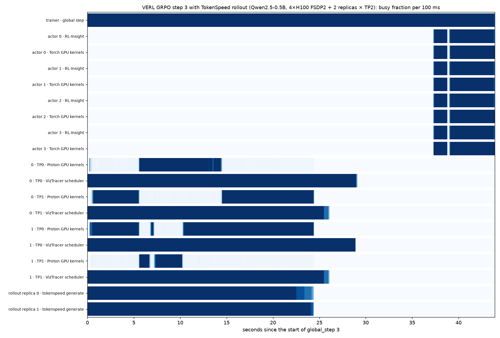

# 2026-10-01：VERL GRPO + TokenSpeed rollout，真实 GPU trace（E0、E2）

Luosuu/rl-trace-observer#10 中 E0 和 E2 的首次结果。复现方式：`scripts/gpu/submit_nebius.sh`（Nebius AI job，8×H100）。

## 环境

| 项 | 值 |
|---|---|
| 机器 | Nebius `gpu-h100-sxm` `8gpu-128vcpu-1600gb`，驱动 580.173，镜像 `nvidia/cuda:13.0.2-devel-ubuntu24.04` |
| 依赖 | `uv.lock`：verl 0.9.1、torch 2.14.0+cu130、tokenspeed 0.1.0.post20260930（nightly）、tokenspeed-kernel 0.1.3.post20260930 |
| 模型 / 数据 | Qwen2.5-0.5B-Instruct，GSM8K |
| 训练 | GRPO，`train_batch_size=32`，`n=4`，`max_response_length=512`，FSDP2 actor 4 卡，5 步 |
| rollout | `rollout.name=tokenspeed`，hybrid，2 个 replica × TP=2，`enforce_eager=True`，`gpu_memory_utilization=0.4` |
| profile | 第 3、4 步：actor Torch（cpu+cuda，all ranks）、TokenSpeed VIZTRACER+PROTON、RL-Insight |

## E0：TokenSpeed 单独运行（`scripts/gpu/tokenspeed_smoke.py`）

- `/generate`（token 进、token 出，带 logprob）、显存 release/resume 后再生成：通过。
- `VIZTRACER+PROTON` profile：
  - 开 `--enforce-eager` 时，每个 TP rank 各产出一个 VizTracer 报告和一个 Proton Chrome trace，都带 `baseTimeNanoseconds`；
  - 有 CUDA graph 时，Proton finalize 失败（"Cannot find CPU scope event for kernel launch"）。后来通过常驻 session 解决，见 [2026-10-02 的记录](2026-10-02-tokenspeed-cuda-graph-proton.md)。
- 每个 rank 的 VizTracer 中有 5904 个 `viztracer->proton` 起点，对应 Proton 中 5904 个带 `scope_id` 的 CPU scope。
- `rl-trace-merge` 与 `tokenspeed merge-traces --all-ranks` 都能合并。两者的 Perfetto 统计相同，都有 3552 个 `flow_duplicate_id` 和 1076 个 `slice_spill_overlapping_complete_event`，这些都来自 Proton 原始数据。merger 修正后（同一 id 的多个 flow 拆开编号），`flow_duplicate_id` 为 0。
- 权重同步：一个“trainer”进程在另一张卡上，通过 `/init_weights_update_group` + `/update_weights_from_distributed` 广播。测试方法是先把 `model.norm.weight` 置零（贪心输出随之改变），再发回原权重（贪心输出完全恢复）。TP=2（唤醒状态，以及 VERL 的睡眠→恢复权重→更新→恢复 KV 时序）和 TP=1 均通过。首次同步 1.1 s（含 NCCL 初始化），之后 0.1 s。

## E2：VERL GRPO 端到端

5 步全部完成；`rl-trace-merge --strict --step 3` 和 `--step 4` 退出码均为 0，manifest 无任何问题。

| step | step 时长 (s) | 生成 (s) | 权重同步 (s) | `rollout_probs_diff_mean` | 平均回复长度 | profile |
|---|---|---|---|---|---|---|
| 1 | 39.1 | 12.1 | 0.88 | 0.0045 | 320 | |
| 2 | 19.7 | 12.1 | 1.02 | 0.0046 | 305 | |
| 3 | 74.9 | 37.2 | 0.84 | 0.0041 | 304 | ✓ |
| 4 | 79.2 | 36.8 | 2.87 | 0.0042 | 313 | ✓ |
| 5 | 19.1 | 12.1 | 2.13 | 0.0044 | 302 | |

- `rollout_probs_diff_mean` 约 0.004，即 TokenSpeed 返回的 logprob 与 actor 重算的结果很接近，说明每步的权重都同步到了 rollout。
- profile 的开销：生成阶段约 3 倍（eager + VizTracer + Proton trace 模式），step 约 4 倍（未单独测量；从时间线看，生成结束到训练开始之间的约 13 s 空档里，大部分应是停 profile 和写出约 1 GB trace 的时间）。不开 profile 的步骤同样以 eager 运行；开销表（E4）还没测。

### 第 3 步合并后的 trace

- **规模**：12.4M 事件，gzip 后 198 MB，Perfetto trace_processor 加载 21 s。
- **组成**：
  - 7 个进程记录：trainer、4 个 actor worker、2 个 TokenSpeed server actor；
  - 第 3 步的 12 个登记产物：4 个 Torch、4 个 TokenSpeed VizTracer（每个约 170 MB）、4 个 Proton（每个约 106 MB）；
  - 7 个 RL-Insight JSONL。
- **TokenSpeed rank 进程**：每个 TP rank 是一个进程，命名为 `<host> pid <server actor> · tokenspeed_server_<r> · TP<k>`。每个进程都有 VizTracer 线程（MainThread、`tokenspeed::forward` 等）、Proton CPU Thread 和 3 条 GPU Stream。
- **生成与 kernel**：每个 replica 64 个 `tokenspeed_generate` 请求（共 128 = 32×4），分布在第 0.06～24.4 s。4 个 rank 的 Proton GPU kernel（各约 15.5 万个）覆盖同一时间段。
- **flow**：共 154 万条，其中 1819 条是 VizTracer→Proton 的 scope flow，都在同一个 rank 进程内部。其余主要是 Torch 和 Proton 各自的 launch→kernel flow。
- **actor 对齐**：每个 rank 上 RL-Insight `actor_update` 与 Torch 对应区间的起点相差 67～104 µs，时长相差小于 0.1 ms，满足 E2 中小于 5 ms 的标准。
- **step 窗口**（`global_step` 窗口长 43.9 s）：
  - rollout 的事件全部落在窗口内；
  - actor 训练从第 37.3 s 开始，到窗口结束为止。
- **剩余的 Perfetto 错误**：`slice_spill_overlapping_complete_event` 133961 个，来自原始数据中同一线程上相互重叠的 X 事件，官方合并结果也有。

### 产物

`s3://bench-artifacts-e00wpqevpr0037mwj6dvm8/rl-trace-observer/rl-trace-e2e-20261001-152401-84458ae/`：
- `e2/step3.json.gz`、`e2/step4.json.gz`、`e2/all_steps.json.gz` 及对应的 manifest；
- `e2/artifacts/`：原始产物；
- `e2/main_ppo.log`、`e2/metrics.txt`。

其中 `step*.json.gz` 是修正 flow 编号之前合并的。用当前的 merger 对 `e2/artifacts` 重新合并，即可去掉 `flow_duplicate_id`。

## 实验中发现并已修复的问题

1. **torch 2.14 自动 split NCCL 组**：默认进程组绑定了设备时，torch 2.14 会把新建的 NCCL 组从默认组 split 出来。TokenSpeed 加入的权重组于是只是它自身 1-rank 世界的一个 split，trainer 永远连不上，首次广播就卡死（py-spy 与 `NCCL_DEBUG` 确认，现象为 `ncclCommSplit … nranks 1`）。现在双方都以独立方式创建这个组，TokenSpeed 一侧通过 `PYTHONPATH` 上的 `sitecustomize` 实现。
2. **profile_id 被忽略**：`tokenspeed serve` 不使用请求中的 `profile_id`，文件名是时间戳。现在每个 profile 写入单独的目录。
3. **Proton 与 CUDA graph**：本次 profile 时用 `rollout.enforce_eager=True`。原因是 TokenSpeed 的 Proton session 建在 graph capture 之后；此问题已在 [2026-10-02](2026-10-02-tokenspeed-cuda-graph-proton.md) 解决。
4. **连接被关闭**：control server 会关闭空闲的 keep-alive 连接，之后复用连接的 POST 会报 `ServerDisconnectedError`。现在每个请求新建连接。
5. **nightly 不配套**：tokenspeed nightly 20261001 引用了同日 kernel nightly 中没有的函数，因此固定为 20260930。

## 尚未完成

- E1 对照：同配置下 vLLM rollout 的 reward 与 `rollout_probs_diff`。
- E3：TP=4×1、更多 replica。
- E4：开销表。
- E5：失败路径。
- 在 Perfetto UI 中人工查看并截图。本次所用的应用内浏览器无法访问本机的 trace_processor，上图为根据同一 trace 的查询结果绘制。
